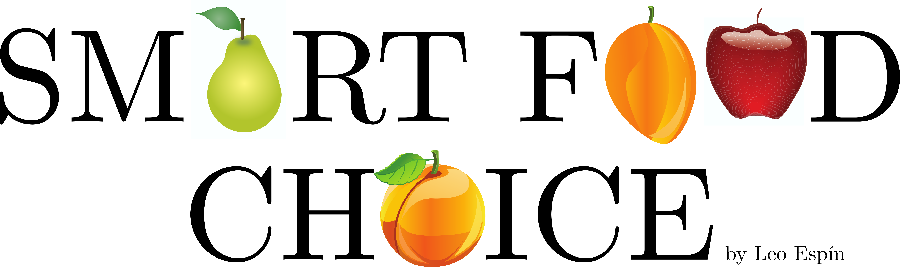

# My Insight webapp repo

In the U.S. it is a know problem that [food labels are difficult to read](https://www.npr.org/sections/thesalt/2019/01/24/688042266/grocery-shoppers-dont-always-know-what-s-best-for-them-can-better-food-labeling). In order to help customers make healthier food choices I add product-tailored visual cues to food labels to try to simplify their interpretation.

I used *unsupervised learning* for creating a labeling system that highlights the most salient information of a given food product. In my webapp, the user inputs the barcode of the product of interest and my webapp will know what information to highlight.
